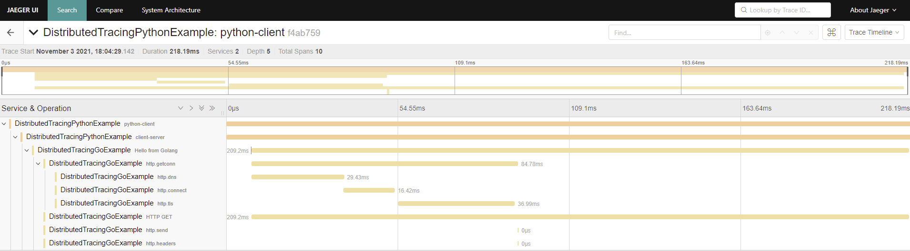

# distributed-tracing

Distributed tracing using OpenTelemetry example

# Application

Application flow with instrumentation

## Python

Script calling HTTP request GET on `http://localhost:7777/hello`.
It is configured to send spans and traces to Jaeger.

## Go

Lightweight REST server exposing endpoint `hello` on port `7777`.
If endpoint is called, server sends request to `https://wp.pl`.

# Trace

Exemplary trace

# Author

@PatrykMatyjasek
